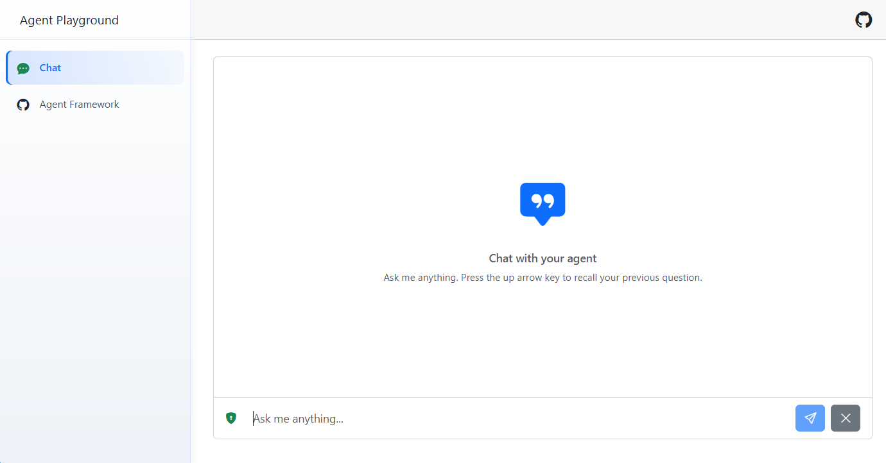
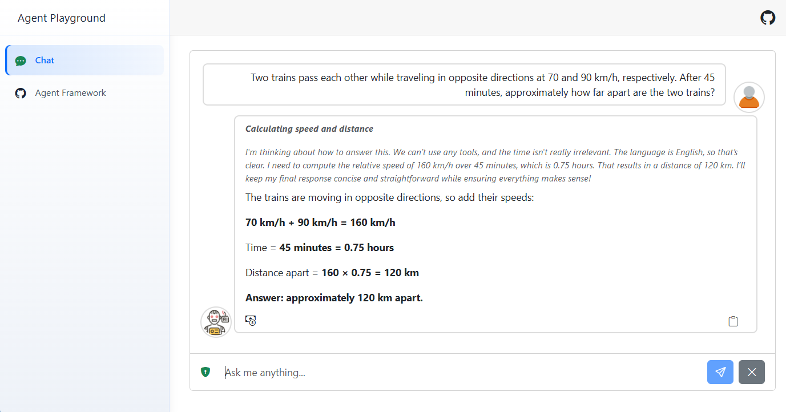

# Agent Playground

[](https://dotnet.microsoft.com/en-us/download/dotnet/10.0)
[](https://dotnet.microsoft.com/apps/aspnet/web-apps/blazor)

A Blazor Web App playground for quickly testing agents built with [Microsoft Agent Framework](https://github.com/microsoft/agent-framework). The project provides a ready-to-use chat UI, session handling, streaming responses, reasoning display, function-call visibility, and token-usage details, so you can focus on defining and experimenting with your agent.

## Table of Contents
- [Overview](#overview)
- [Screenshots](#screenshots)
- [Prerequisites](#prerequisites)
- [Project Structure](#project-structure)
- [Setup](#setup)
- [Supported Features](#supported-features)
- [How to Use](#how-to-use)
- [Limitations & FAQ](#limitations-faq)
- [Contributing](#contributing)
- [License](#license)

---

## Overview
This application allows you to:
- Define a Microsoft Agent Framework agent in one place: [`Program.cs`](AgentPlayground/Program.cs)
- Test the agent immediately through a Blazor chat interface
- Stream answers as they are generated
- Show reasoning output when the model provides it
- Show function/tool calls made by the agent
- Display token usage for each completed answer
- Keep conversation history through an `AgentSessionStore`

The goal is to provide a lightweight playground for local agent experiments. Instead of rebuilding a chat UI and streaming pipeline for every test, you can configure the `PlaygroundAgent` and start interacting with it from the browser.

The default agent is registered in [`Program.cs`](AgentPlayground/Program.cs) with the name `PlaygroundAgent`. The [`AgentService`](AgentPlayground/Services/AgentService.cs) is already wired to that agent and its session store, and exposes a streaming method that the Blazor UI consumes.

## Screenshots





## Prerequisites
- [.NET 10 SDK](https://dotnet.microsoft.com/en-us/download/dotnet/10.0)
- An AI provider account and API key
- A chat model supported by Microsoft Agent Framework or exposed through an `IChatClient` integration

## Project Structure
- `AgentPlayground/` - Main Blazor Web App
  - `Components/` - Blazor UI components and the chat page
  - `Models/` - Request and response models used by the chat pipeline
  - `Services/` - Agent execution and session-store services
  - `Settings/` - Configuration classes
  - `Tools/` - Example tools/functions that can be exposed to the agent
  - `Tracing/` - HTTP tracing utilities for inspecting requests sent to the configured AI provider

## Setup

1. Clone the repository

    ```bash
    git clone https://github.com/marcominerva/AgentPlayground.git
    ```

2. Configure the AI provider

   The default sample uses Azure OpenAI. Edit `AgentPlayground/appsettings.json` and set the corresponding values:

    ```json
    {
      "AzureOpenAI": {
        "Endpoint": "https://<your-resource>.openai.azure.com/openai/v1/",
        "Deployment": "<your-chat-deployment>",
        "ApiKey": "<your-api-key>"
      },
      "AppSettings": {
        "MessageExpiration": "00:05:00",
        "MessageLimit": 20
      }
    }
    ```

   The playground is not tied to Azure OpenAI. You can use any provider supported by Microsoft Agent Framework, or any provider that can expose an `IChatClient`: add the corresponding settings to `appsettings.json`, reference the required Agent Framework/provider packages, and configure the chat client accordingly in [`Program.cs`](AgentPlayground/Program.cs).

   For example, to use Anthropic, add a configuration section like this:

    ```json
    {
      "Anthropic": {
        "ModelId": "claude-sonnet-4-5",
        "ApiKey": "<your-api-key>"
      },
      "AppSettings": {
        "MessageExpiration": "00:05:00",
        "MessageLimit": 20
      }
    }
    ```

   Then add the [`Microsoft.Agents.AI.Anthropic`](https://www.nuget.org/packages/Microsoft.Agents.AI.Anthropic) package, create the Anthropic client, and convert it to `IChatClient` with `AsIChatClient(modelId)`:

    ```csharp
    var anthropicSettings = builder.Configuration.GetSection("Anthropic");

    builder.Services.AddChatClient(_ =>
    {
        var apiKey = anthropicSettings["ApiKey"]!;
        var modelId = anthropicSettings["ModelId"]!;

        var anthropicClient = new AnthropicClient { ApiKey = apiKey };
        return anthropicClient.AsIChatClient(modelId);
    });

    ```

   The `PlaygroundAgent` registration remains the same as shown in the next step: it only needs an `IChatClient` from dependency injection (see below).

3. Configure the agent

   Open [`Program.cs`](AgentPlayground/Program.cs) and update the `PlaygroundAgent` registration:

    ```csharp
    builder.Services.AddAIAgent("PlaygroundAgent", (services, key) =>
    {
        var chatClient = services.GetRequiredService<IChatClient>();

        return chatClient.AsAIAgent(new ChatClientAgentOptions
        {
            Id = key.ToLowerInvariant(),
            Name = key,
            ChatOptions = new()
            {
                Instructions = """
                    You are a helpful assistant. Answer the user's questions in the same language as the question.
                    """,
                Reasoning = new()
                {
                    Effort = ReasoningEffort.Low,
                    Output = ReasoningOutput.Summary
                },
                Tools = [new HostedWebSearchTool(), AIFunctionFactory.Create(DateTimeTools.GetCurrentDateTime)]
            }
        },
        loggerFactory: services.GetRequiredService<ILoggerFactory>(),
        services: services);
    }, ServiceLifetime.Scoped)
    .WithSessionStore((services, _) => services.GetRequiredService<HybridCacheSessionStoreService>(), withIsolation: false);
    ```

   You can change the instructions, model options, reasoning options, and tools without touching the UI.

4. Run the application

    ```bash
    dotnet run --project AgentPlayground/AgentPlayground.csproj
    ```

5. Access the Web App
   - Navigate to the HTTPS URL shown in the console.

## Supported features

- **Ready-to-use Blazor chat UI**: The home page contains the chat experience, including message streaming, copy-to-clipboard, conversation reset, and Markdown rendering.
- **Single agent configuration point**: Configure `PlaygroundAgent` in [`Program.cs`](AgentPlayground/Program.cs), then test it directly from the browser.
- **Microsoft Agent Framework integration**: The app uses `AddAIAgent`, `ChatClientAgentOptions`, `AIAgent`, and `AgentSessionStore` from Microsoft Agent Framework.
- **Conversation history**: Sessions are stored with [`HybridCacheSessionStoreService`](AgentPlayground/Services/HybridCacheSessionStoreService.cs), so follow-up questions can use prior context.
- **Response streaming**: [`AgentService`](AgentPlayground/Services/AgentService.cs) exposes `AskStreamingAsync`, which streams answer chunks to the UI as they arrive.
- **Reasoning visibility**: Reasoning text emitted by the agent is surfaced separately in the stream.
- **Function-call visibility**: Tool/function calls are displayed while the answer is being generated.
- **Token usage details**: The final stream message includes token usage for the completed response.
- **HTTP tracing**: The configured `TraceHttpClientHandler` can print raw requests sent to Azure OpenAI to help debug agent behavior.

## How to Use

- **Configure your agent**: Edit the `PlaygroundAgent` definition in [`Program.cs`](AgentPlayground/Program.cs).
- **Add or remove tools**: Add function tools through `AIFunctionFactory.Create(...)`, hosted tools such as `HostedWebSearchTool`, or your own Microsoft Agent Framework-compatible tools.
- **Run the app**: Start the Blazor app and open the chat page.
- **Ask questions**: The UI sends each question to [`AgentService`](AgentPlayground/Services/AgentService.cs), which invokes the configured agent and streams the response back.
- **Inspect behavior**: Watch the answer, reasoning, function calls, and token usage in the UI. Use console tracing when you need to inspect the raw OpenAI request payload.

### How it works

1. The Blazor home page creates a `Question` with a conversation ID and the user's text.
2. The page calls `AgentService.AskStreamingAsync`.
3. `AgentService` retrieves the session for `PlaygroundAgent` through `AgentSessionStore`.
4. The service calls `agent.RunStreamingAsync(...)` and processes each streamed update.
5. Text chunks are returned with `StreamState.Answering`.
6. Reasoning chunks are returned with `StreamState.Reasoning`.
7. Function calls are returned with `StreamState.FunctionCalling`.
8. After streaming completes, the session is saved and a final `StreamState.Completed` message is returned with token usage.
9. The Blazor UI renders the stream incrementally and shows final token details.

### Streaming states

The chat stream uses the `StreamState` enum to identify what each update represents:

- `Answering`: normal answer text generated by the agent.
- `Reasoning`: reasoning text emitted by the model when reasoning output is enabled.
- `FunctionCalling`: a tool/function call made by the agent.
- `Completed`: the final message, containing token usage for the full response.

## Limitations & FAQ

- **Session storage**: The default session store uses `HybridCache`. Configure cache options as needed for your testing scenario.
- **Reasoning availability**: Reasoning output depends on the model and options configured in `ChatOptions`.
- **Tool-call display**: Function calls are shown from streamed content emitted by the agent. Tool result formatting depends on the agent/model behavior.
- **Secrets**: Do not commit real API keys. Prefer user secrets, environment variables, or your secret manager of choice.

## Contributing

Contributions are welcome! Please open issues or pull requests. For major changes, discuss them first via an issue.

## License

This project is licensed under the MIT License. See the [LICENSE](LICENSE) file for details.
